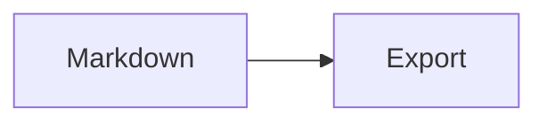

# Markout

Éditeur Markdown **local** : vous écrivez, vous voyez les diagrammes Mermaid, vous exportez un **PDF** ou un **Word** propre — sans Pandoc, sans Chrome, sans compte cloud.

> Tu écris. Tu cliques. Tu envoies.

## Installation

Chaque push sur `main` déclenche un build CI. Les installateurs sont ensuite disponibles **sans cloner le dépôt** :

1. **[Télécharger la dernière version](https://github.com/umbrelladotdev/markout/releases/latest)** — page GitHub Releases (tag `latest`, mise à jour à chaque build réussi).
2. Ou onglet **Actions** → run **Publish** → **Artifacts** (fichiers identiques, conservés 90 jours).

### Windows (cible MVP)

1. Téléchargez l’installateur **`.exe`** (NSIS, recommandé) ou **`.msi`**.
2. Installez Markout.
3. **WebView2** : Windows 11 l’embarque déjà. Sur Windows 10, si l’application refuse de démarrer, installez [Microsoft Edge WebView2 Runtime](https://developer.microsoft.com/microsoft-edge/webview2/). L’installateur NSIS peut proposer le bootstrapper.

Aucune autre dépendance n’est requise pour rédiger ou exporter (pas de Node, pas de Pandoc, pas de navigateur à part).

### Linux

Installez le paquet **`.deb`** fourni sur la [release](https://github.com/umbrelladotdev/markout/releases/latest) (WebKitGTK 4.1 est requis).

### macOS

Ouvrez le **`.dmg`**. L’application n’est pas signée : Gatekeeper peut bloquer le premier lancement (`Réglages système` → `Confidentialité et sécurité` → autoriser Markout).

### Développement (macOS / Linux / Windows)

Prérequis : [Rust](https://rustup.rs/) **1.88+**, Node.js 22, et les [dépendances système Tauri 2](https://v2.tauri.app/start/prerequisites/). Un fichier `rust-toolchain.toml` pinne 1.88.

```bash
npm install
npm run tauri -- dev
```

L’interface peut aussi tourner dans un navigateur (`npm run dev`) pour l’édition ; les dialogues natifs et l’ouverture OS des exports sont ceux de l’app Tauri.

## Usage

1. Ouvrez Markout.
2. Écrivez ou collez du Markdown, ou **Ouvrir** un fichier `.md`.
3. Ajoutez un diagramme :

````markdown

````

4. Vérifiez l’aperçu à droite.
5. Cliquez **Exporter PDF** ou **Exporter Word**, puis choisissez l’emplacement.

Raccourcis : `Ctrl+N` nouveau, `Ctrl+O` ouvrir, `Ctrl+S` enregistrer, `Ctrl+E` PDF, `Ctrl+Shift+E` Word.

Le brouillon est enregistré automatiquement en local (stockage de l’application / navigateur).

### Export Word et table des matières

Le DOCX contient un **champ TOC Word**. À la première ouverture dans Microsoft Word, cliquez dans la table des matières et appuyez sur **F9** (mettre à jour les champs). LibreOffice Writer reconnaît en général le champ de la même façon.

## Limites Mermaid (MVP)

Types testés : `flowchart`, `stateDiagram-v2`, `mindmap`, `pie`, `gantt`, `timeline`.

- Un diagramme **invalide** s’affiche encadré dans l’aperçu ; **l’export est bloqué** tant qu’il n’est pas corrigé.
- Les diagrammes sont pré-rendus (SVG puis PNG) **avant** la génération PDF/DOCX : le livrable ne contient jamais le source Mermaid.
- Certaines syntaxes expérimentales ou thèmes HTML riches peuvent diverger légèrement entre l’aperçu et l’image d’export.
- Pas d’Excalidraw, PlantUML, ni collaboration temps réel dans cette version.

Jeux de tests versionnés : [`fixtures/`](fixtures/).

## Documentation

- [Cahier des charges](docs/cahier-des-charges.md)
- [Taille et dépendances embarquées](docs/bundle-et-dependances.md)
- [Écarts MVP](docs/ecarts-mvp.md)

## Licence

Projet privé — usage interne tant qu’une licence n’est pas publiée.
