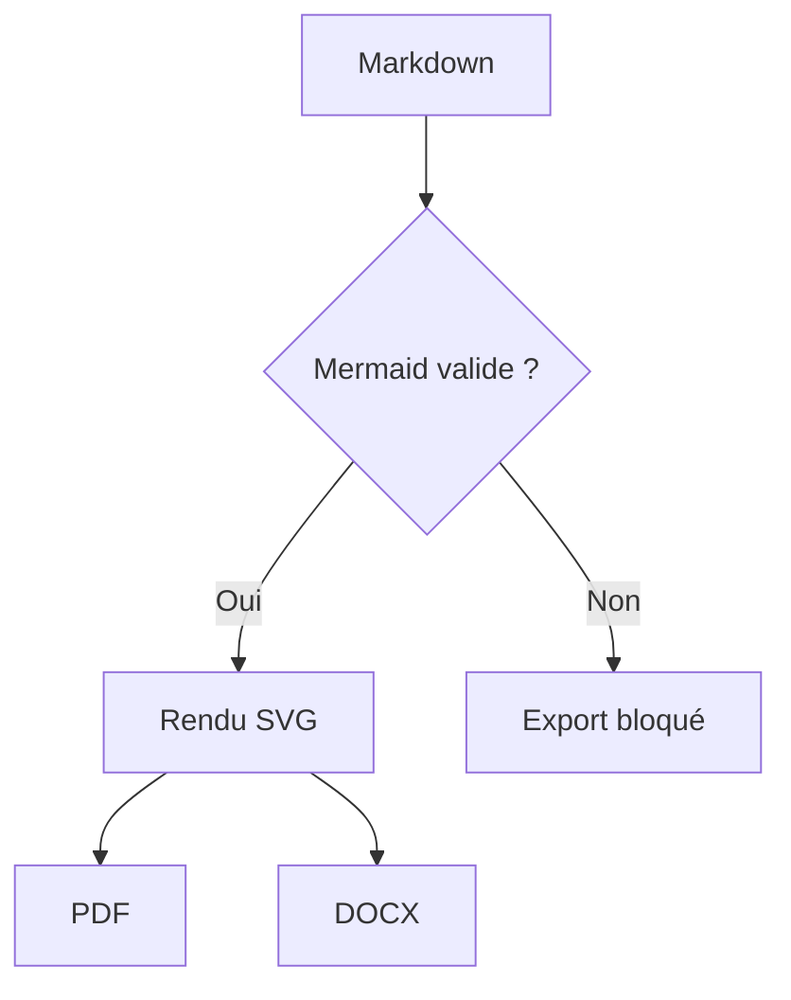
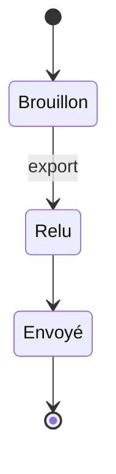
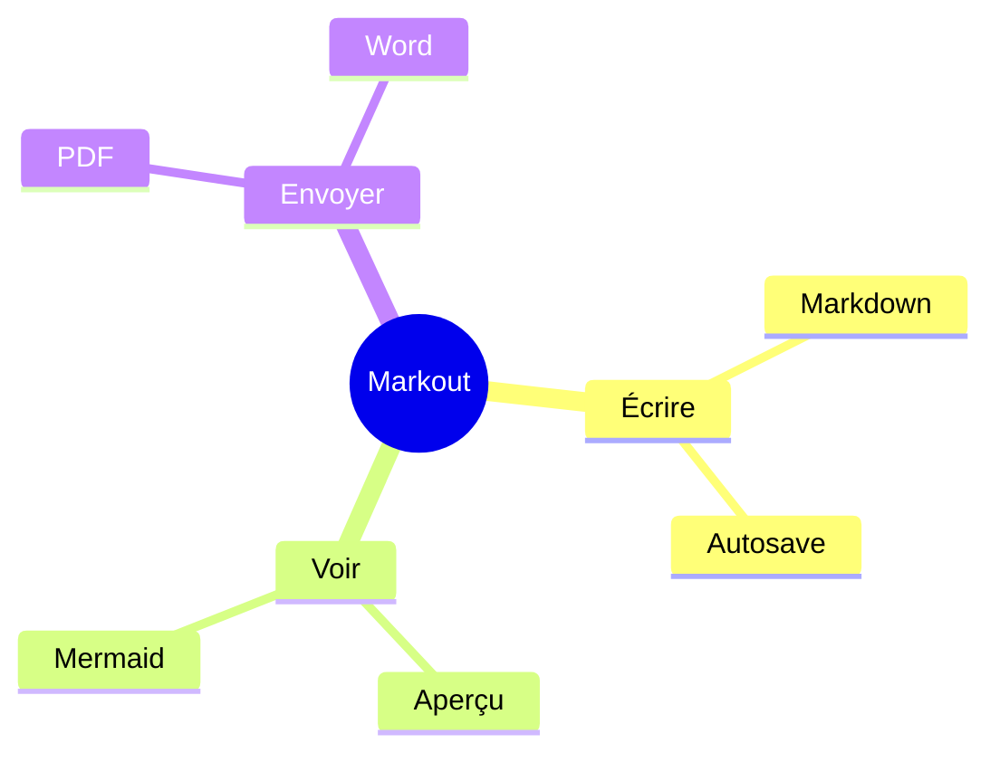
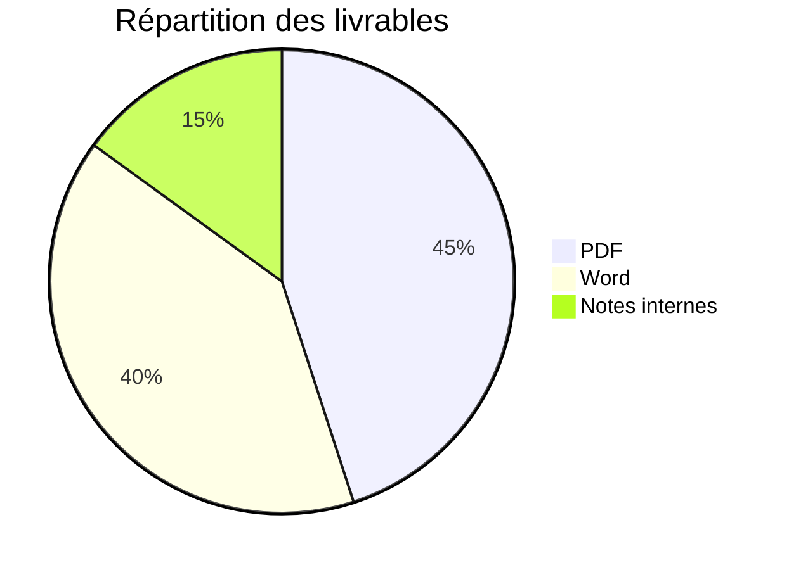
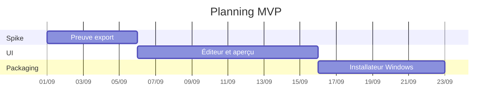
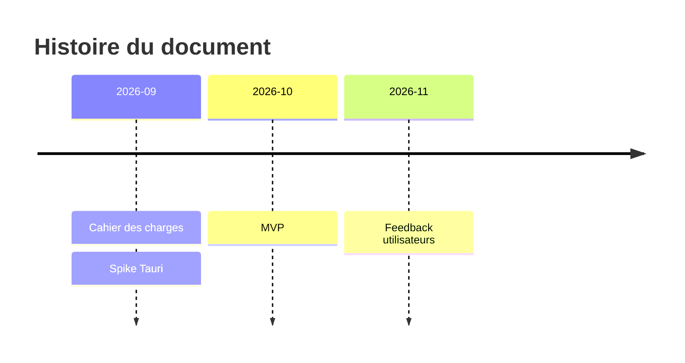

# Markout — document d’acceptance MVP
# Accents : café, déjà, français, œuf, naïve

Ceci est le jeu de fixtures pour les tests T1–T6.

## 1. Introduction

Un livrable propre doit contenir des **titres**, des *listes*, des [liens](https://example.com), des citations et des tableaux — sans jamais laisser le source Mermaid dans le PDF ou le Word.

> La fiabilité de l’export est le critère de succès.

## 2. Listes

- Café stratégique
- Dossier partenaire
- Compte-rendu d’atelier

1. Rédiger
2. Vérifier l’aperçu
3. Exporter

## 3. Tableau GFM

| Étape | Responsable | Statut |
| --- | --- | --- |
| Rédaction | Fondateur | Fait |
| Schémas | Consultant | En cours |
| Export | Markout | Prêt |

## 4. Flowchart

## 5. State diagram

## 6. Mindmap

## 7. Camembert

## 8. Gantt

## 9. Timeline

## 10. Conclusion

Les diagrammes ci-dessus doivent apparaître comme des **images**, jamais comme du texte `flowchart` / `stateDiagram` brut.
